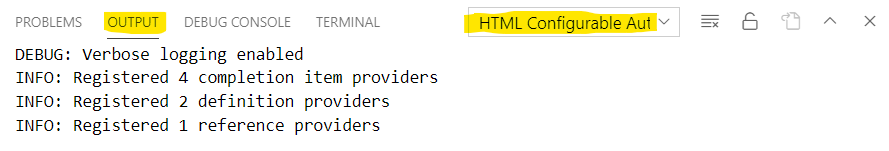

# HTML Configurable Autocomplete
**Autocomplete your HTML** content, **navigate to definitions** and **find references** by providing simple matching rules. Be proud of your frameworkless / non-conformant project and be productive again with this extension!

## Features
This extension provides:
 * _completion items_ when you type specific character(s). They are enabled for HTML files;
 * _navigate to definitions_ of components. They are enabled for HTML files;
 * _find references_ of a component. They are enabled for JavaScript files.


It needs your configuration so it can find completion items and definitions in your project. Here's a sample configuration you can see in action in this GitHub project.

[https://github.com/Halleymedia/vuejs-es6-demo](https://github.com/Halleymedia/vuejs-es6-demo)

Take a look at the [.vscode/settings.json](https://github.com/Halleymedia/vuejs-es6-demo/blob/master/.vscode/settings.json) file in particular.

```js
{
  // Enable the extension (it can be omitted)
  "htmlConfigurableAutocomplete.enable": true,

  // Enable debug but only if you need more verbose logging to diagnose transformers or regexp issues
  "htmlConfigurableAutocomplete.debug": true,

  // Tell it how to autocomplete HTML content
  "htmlConfigurableAutocomplete.completionItemProviders": [
    {
      // Can be omitted
      "enable": true,
      // It should be activated when < is pressed (for tag names)
      "triggerCharacters": [
        "<"
      ],
      // Then look into js files in the components directory
      "includeGlobPattern": "src/components/**/*.js",
      // Find the component name in there and show it as a completion item
      "contentRegexp": "@Component\\(\\s*['\"]\\s*([a-z-]+)",
      // It should have this icon
      "itemKind": "Constant"
    },
    {
      // Can be omitted
      "enable": true,
      // It should also be activated when space is pressed (for attributes)
      "triggerCharacters": [
        " "
      ],
      // But just when the cursor is in an element tag, at a position where an attribute name can be inserted
      "triggerRegexp": "<[a-z-]+(\\s+[a-z-]+(=\".*?\")?)*[^\"<>]*",
      // Show a couple statically-defined completion items
      "staticItems": [
        "data-for",
        "data-if"
      ],
      // We're typing an attribute name here, so let's help the user by adding ="" right after. The cursor will stop in between double quotes
      "completionItemSuffix": "=\"\t\"",
      // They should have this icon
      "itemKind": "Enum"
    },
    {
      // Can be omitted
      "enable": true,
      // It should also be activated when space is pressed (for attributes)
      "triggerCharacters": [
        " "
      ],
      // But just when the cursor is in an element tag, at a position where an attribute name can be inserted
      "triggerRegexp": "<[a-z-]+(\\s+[a-z-]+(=\".*?\")?)*[^\"<>]*",
      // Let's go look for this component definition and get its public fields (the definition is found thanks to the definition provider configured below)
      "includeGlobPattern": "${definitionFilePath}",
      // Transform original JavaScript content into a list of class and member definitions
      "contentTransformer": "es6-module-nodes",
      // And inside of it, look for setter methods
      "contentRegexp": "instance public set ([a-z0-9_]+)",
      // We're typing an attribute name here, so let's help the user by adding ="" right after. The cursor will stop in between double quotes
      "completionItemSuffix": "=\"\t\"",
      // JavaScript properties are in camel case, so we transform them in kebab case since they will be used as element attributes
      "completionItemTransformer": "camelcase-to-kebabcase",
      // They should have this icon
      "itemKind": "Field"
    },
    {
      // Can be omitted
      "enable": true,
      // It should also be activated when { is pressed (for moustached syntax)
      "triggerCharacters": [
        "{"
      ],
      // But just when two { have been typed already
      "triggerRegexp": "{{",
      // Go look inside a js file that has the same name and lives in the same directory
      "includeGlobPattern": "${dirPath}${fileNameWithoutExtension}[.]js",
      // Transform JS content as a list of class and members definitions
      "contentTransformer": "es6-module-nodes",
      // And inside of it, look for properties
      "contentRegexp": "instance public property ([a-z0-9_]+)",
      // It should have this icon
      "itemKind": "Field"
    },
    {
      // Can be omitted
      "enable": true,
      // It should also be activated when { is pressed (for moustached syntax)
      "triggerCharacters": [
        "{"
      ],
      // But just when the cursor is inside an element with the data-for attribute
      "triggerRegexp": "data-for=.*?>.*{{",
      // Before executing triggerRexep though, flatten the HTML of the current document
      "triggerTransformer": "flatten-html",
      // Show a couple statically-defined completion items
      "staticItems": [
        "$item",
        "$index"
      ],
      // They should have this icon
      "itemKind": "Enum"
    },
  ],

  // Now tell it how to navigate to definitions
  "htmlConfigurableAutocomplete.definitionProviders": [
    {
      // Can be omitted
      "enable": true,
      // Definitions are provided when the cursor is on tag names having a - in them
      "definitionRegexp": "</?([a-z]+-[a-z]+)[^>]*",
      // Then go look inside js files that live in the components directory
      "includeGlobPattern": "src/components/**/*.js",
      // And find that very same tag name in them; if one is found, VSCode navigates to definition!
      "contentRegexp": "@Component\\(\\s*['\"]\\s*([a-z-]+)"
    },
    {
      // Can be omitted
      "enable": true,
      // Definitions are provided when the cursor is inside moustaches
      "definitionRegexp": "{{\\s*(.+?)\\s*}}",
      // Then go look inside js file that lives in the same directory and has the same name with the js extension
      "includeGlobPattern": "${dirPath}${fileNameWithoutExtension}[.]js",
      // Then find the field it's referring to
      "contentRegexp": "^\\s*([a-z0-9_]+)\\s*;?\\s*$"
    }
  ],

  // Tell it how to find references (i.e. usages) in the project
  "htmlConfigurableAutocomplete.referenceProviders": [
    {
      // Can be omitted
      "enable": true,
      // Get the name of the component so we can find references in the project
      "referenceRegexp": "@Component\\(\\s*['\"]\\s*([a-z-]+)",
      // Look for references inside HTML files
      "includeGlobPattern": "src/components/**/*.html",
      // References look like tag elements with a - in their name
      "contentRegexp": "<([a-z]+-[a-z]+)"
    }
  ]
}
```

## Requirements

No requirements.

## Extension Settings

This extension contributes the following settings:
 * `htmlConfigurableAutocomplete.enable`: default is _true_. Set to _false_ only if you want to disable this extension;
 * `htmlConfigurableAutocomplete.debug`: set to _true_ for a more verbose logging. It will give you better visibility into regular expression matches and content transformation results;
 * `htmlConfigurableAutocomplete.completionItemProviders`: set rules for item completion (see the example above for details);
 * `htmlConfigurableAutocomplete.definitionProviders`: set rules for definitions  (see the example above for details).
 * `htmlConfigurableAutocomplete.referenceProviders`: set rules for references  (see the example above for details).

> **Important** This extension supports hot configuration reload so any change will be immediately applied. No need to restart VSCode. If something's not working, check the output channel "HTML Configurable Autocomplete" because you might find helpful messages there (e.g. an invalid regexp which is breaking the provider). Enable more verbose logging by setting `htmlConfigurableAutocomplete.debug` to `true`.

The following configuration keys indicate glob patterns:
 * `htmlConfigurableAutocomplete.completionItemProviders[].includeGlobPattern`;
 * `htmlConfigurableAutocomplete.completionItemProviders[].excludeGlobPattern`; 
 * `htmlConfigurableAutocomplete.definitionProviders[].includeGlobPattern`;
 * `htmlConfigurableAutocomplete.definitionProviders[].excludeGlobPattern`;
 * `htmlConfigurableAutocomplete.referenceProviders[].includeGlobPattern`;
 * `htmlConfigurableAutocomplete.referenceProviders[].excludeGlobPattern`.

They support the following placeholders which will be replaced at runtime. Suppose the user has the editor opened on `src/components/layout/MainLayout.html`:
 * `${dirName}` is replaced with `layout`;
 * `${dirPath}` is replaced with `src/components/layout/`;
 * `${filePath}` is replaced with `src/components/layout/MainLayout.html`;
 * `${fileName}` is replaced with `MainLayout.html`;
 * `${fileNameWithoutExtension}` is replaced with `MainLayout`.

Additionally, the following placeholders are also supported for glob patterns of _completion item providers_. They need at least one configured definition provider which is matching code at the current cursor position. If a definition is found, its file path will be used to replace these placeholders. Supposed a definition is found in `src/components/shared/LoadingIndicator.js`:
 * `${definitionDirName}` is replaced with `shared`;
 * `${definitionDirPath}` is replaced with `src/components/shared/`;
 * `${definitionFilePath}` is replaced with `src/components/shared/LoadingIndicator.js`;
 * `${definitionFileName}` is replaced with `LoadingIndicator.js`;
 * `${definitionFileNameWithoutExtension}` is replaced with `LoadingIndicator`.

## Transformers
Using regular expressions to match parts of a JavaScript file might yield imprecise results. For instance, suppose you wanted to find all properties in a ES6 class like this.
```
export default class Foo {
  loading
  animating
  
  load () {
    if (loading) {
      return
    }
    this.loading = true
    console.log('loading started')
  }
}
```
If you wrote a regular expression like `^\s*([a-z0-9_]+)\s*$`, it would correctly match `loading` and `animating`, which is the two properties we are looking for, but it would also match `return` which is obviously not a property.

By using transformers, this extension can pre-process content before a regular expression is executed. For instance, by using the `es6-module-nodes` transformer, the previous ES6 class would be transformed like so:
```
0,15 default class Foo  
1,4 default class Foo  instance public property loading 
2,4 default class Foo  instance public property animating 
4,4 default class Foo  instance public method load 
``` 
As you can see, each line represents a class or member definition and its node position in the original file. This way, it becomes way easier to write a regular expression that matches all properties. Try with `instance public property ([a-z0-9_]+)`

## List of supported transformers

### es6-module-nodes
Internally uses `babel-eslint` to create a textual representation of a ES6 class that's easier for regexp to work on.

It can be used for the following settings:
 * `htmlConfigurableAutocomplete.completionItemProviders[].contentTransformer`
 * `htmlConfigurableAutocomplete.definitionProviders[].contentTransformer`

Here's a more complete example. The following ES6 class:
```
@Fizz @Buzz
class Foo {
  #loading

  @Bindable
  animating
  
  @Handler
  load () {
    if (loading) {
      return
    }
    this.loading = true
    console.log('loading started')
  }
  static configure() {
    void(0)
  }
  get percent() {
    return Math.random()
  }
  set visibile(value) {
    void(value)
  }
}
export default Foo
```
It's going to be transformed to
```
0,0 default class Foo @Fizz,@Buzz
2,4 default class Foo @Fizz,@Buzz instance private property loading 
4,4 default class Foo @Fizz,@Buzz instance public property animating @Bindable
7,4 default class Foo @Fizz,@Buzz instance public method load @Handler
15,4 default class Foo @Fizz,@Buzz static public method configure 
18,4 default class Foo @Fizz,@Buzz instance public get percent 
21,4 default class Foo @Fizz,@Buzz instance public set visibile 
```
Class info is repeated for each of its members, in case you wanted to match members of just a particular class. Each output line starts with the zero-based position (line,character) where the original node started.

The previous example showed the ES6-style exports but it also works with node-style exports (e.g. `module.exports = class Foo {}`).

### flatten-html
Sometimes you want to display some completion items only when you're in a specific portion of the HTML document, such as an ancestor element having a specific attribute. This transformer uses [htmlparser2](https://www.npmjs.com/package/htmlparser2) to parse the HTML content and then it will flatten the HTML hierarchy of elements so it will be easier for you to write a regular expression.

It can be used for the following settings:
 * `htmlConfigurableAutocomplete.completionItemProviders[].triggerTransformer`

Suppose the current editor has this HTML content:

```
<div data-for="foo">
  <span>bar</span>
</div>
```

It will be transformed as follows, by repeating all ancestors for each given element or text node.

```
<div data-for="foo">
<div data-for="foo"><span>
<div data-for="foo"><span>bar
```

It's now easier to write the `triggerRegexp`, since it will execute on this transformed content. Here's an example of a `triggerRegexp` which will match the `span` element only if inside an ancestor having the `data-for` attribute. 

```
<.*?data-foo=.*?>.*<span
```


### camelcase-to-kebabcase
Simply transforms a `camelCase` string into `kebab-case`.

It can be used for the following setting:
 * `htmlConfigurableAutocomplete.completionItemProviders[].completionItemTransformer`

For instance, `myProperty` is transformed to `my-property`.

### kebabcase-to-camelcase
Simply transforms a `kebab-case` string into `camelCase`.

It can be used for the following setting:
 * `htmlConfigurableAutocomplete.definitionProviders[].definitionTransformer`

For instance, `my-property` is transformed to `myProperty`.

## Logging
This extension will log messages to a Visual Studio Code output channel named "HTML Configurable Autocomplete". These messages might help you understanding how your rules and regular expressions are behaving, expecially if you set the `htmlConfigurableAutocomplete.debug` option to `true`.



## Known Issues

Oh well, some things could be improved...

 * The use of transformers might lead to suboptimal performance with large projects since no caching mechanism is used in the current version. Caching for completion items, definitions and references might be implemented in a future version, along with file watchers for automatic cache invalidation.

## Release Notes

### 1.3.1 (2020-09-22)

 - fixed a bug on navigating to definition when the `es6-module-nodes` transformer is used.

### 1.3.0 (2020-08-26)

 - transformer `flatten-html`;
 - completion item prefix and suffix.

### 1.2.0 (2020-08-19)

 - 3 transformers: `es6-module-nodes`, `camelcase-to-kebabcase`, `kebabcase-to-camelcase`;
 - Verbose logging via the `debug` setting.

### 1.1.0 (2020-07-29)

 - Added reference providers;
 - Added support for `${definition...}` placeholders in glob patterns of completion item providers;
 - Added hot configuration reload.

### 1.0.0 (2020-07-26)

Initial release of these two features for HTML files:
 - Added completion item providers;
 - Added definition providers.