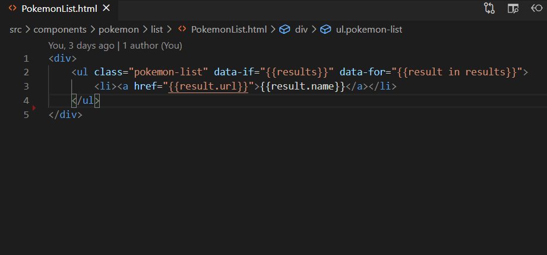

# HTML Configurable Autocomplete
**Autocomplete your HTML** content and **navigate to definitions** by providing simple matching rules. Be proud of your frameworkless / non-conformant project and be productive again with this extension!

## Features
This extension provides completion items to HTML content and navigate to definitions.



It needs your configuration so it can find completion items and definitions in your project. Here's a sample configuration you can see in action in this GitHub project.

[https://github.com/Halleymedia/vuejs-es6-demo](https://github.com/Halleymedia/vuejs-es6-demo)

Take a look at the [.vscode/settings.json](https://github.com/Halleymedia/vuejs-es6-demo/blob/master/.vscode/settings.json) file in particular.

```json
{
  //Enable the extension (it can be omitted)
  "htmlConfigurableAutocomplete.enable": true,

  //Tell it how to autocomplete HTML content
  "htmlConfigurableAutocomplete.completionItemProviders": [
    {
      //Can be omitted
      "enable": true,
      //It should be activated when < is pressed (for tag names)
      "triggerCharacters": ["<"],
      //Then look into js files in the components directory
      "includeGlobPattern": "src/components/**/*.js",
      //Find the component name in there and show it as a completion item
      "contentRegexp": "@Component\\(\\s*['\"]\\s*([a-z-]+)",
      //It should have this icon
      "itemKind": "Constant"
    },
    {
      //Can be omitted
      "enable": true,
      //It should also be activated when space is pressed (for attributes)
      "triggerCharacters": [" "],
      //But just when the cursor is in an element tag, at a position where an attribute name can be inserted
      "triggerRegexp": "<[a-z-]+(\\s+[a-z-]+(=\".*?\")?)*[^\"<>]*",
      //Show a couple statically-defined completion items
      "staticItems": ["data-for", "data-if"],
      //They should have this icon
      "itemKind": "Enum"
    },
    {
      //Can be omitted
      "enable": true,
      //It should also be activated when { is pressed (for moustached syntax)
      "triggerCharacters": ["{"],
      //But just when two { have been typed already
      "triggerRegexp": "{{",
      //Go look inside a js file that has the same name and lives in the same directory
      "includeGlobPattern": "${dirPath}${fileNameWithoutExtension}[.]js",
      //And inside of it, look for fields (I know, I know, this should be more robust and maybe use a proper js parser)
      "contentRegexp": "^\\s*([a-z0-9_]+)\\s*;?\\s*$",
      //It should have this icon
      "itemKind": "Field"
    }
  ],
  //Now tell it how to navigate to definitions
  "htmlConfigurableAutocomplete.definitionProviders": [
    {
      //Can be omitted
      "enable": true,
      //Definitions are provided when the cursor is on tag names having a - in them
      "definitionRegexp": "</?([a-z]+-[a-z]+)",
      //Then go look inside js files that live in the components directory
      "includeGlobPattern": "src/components/**/*.js",
      //And find that very same tag name in them; if one is found, VSCode navigates to definition!
      "contentRegexp": "@Component\\(\\s*['\"]\\s*([a-z-]+)"
    },
    {
      //Can be omitted
      "enable": true,
      //Definitions are provided when the cursor is inside moustaches
      "definitionRegexp": "{{\\s*(.+?)\\s*}}",
      //Then go look inside js file that lives in the same directory and has the same name with the js extension
      "includeGlobPattern": "${dirPath}${fileNameWithoutExtension}[.]js",
      //Then find the field it's referring to
      "contentRegexp": "^\\s*([a-z0-9_]+)\\s*;?\\s*$"
    }
  ]
}
```


## Requirements

No requirements.

## Extension Settings

This extension contributes the following settings:
* `htmlConfigurableAutocomplete.enable`: set to _false_ in case you want to disable the extension;
* `htmlConfigurableAutocomplete.completionItemProviders`: set rules for item completion (see the example above for details);
* `htmlConfigurableAutocomplete.definitionProviders`: set rules for definitions  (see the example above for details).

> **Important** VSCode must be reloaded after changing the configuration. This will be fixed in a future release.

The following configuration keys indicate glob patterns:
* `htmlConfigurableAutocomplete.completionItemProviders.includeGlobPattern`;
* `htmlConfigurableAutocomplete.completionItemProviders.excludeGlobPattern`; 
* `htmlConfigurableAutocomplete.definitionProviders.includeGlobPattern`;
* `htmlConfigurableAutocomplete.definitionProviders.excludeGlobPattern`.

They support the following placeholders which will be replaced at runtime. Suppose the user has the editor opened on `src/components/layout/MainLayout.html`:
* `${dirName}` is replaced with `layout`;
* `${dirPath}` is replaced with `src/components/layout/`;
* `${filePath}` is replaced with `src/components/layout/MainLayout.html`;
* `${fileName}` is replaced with `MainLayout.html`;
* `${fileNameWithoutExtension}` is replaced with `MainLayout`.

Additionally, the following placeholders are also supported if you configured at least one definition provider which is matching code at the current cursor position. If a definition is found, its file path will be used to replace these placholders. Supposed a definition is found at `src/components/shared/LoadingIndicator.js`:
* `${definitionDirName}` is replaced with `shared`;
* `${definitionDirPath}` is replaced with `src/components/shared/`;
* `${definitionFilePath}` is replaced with `src/components/shared/LoadingIndicator.js`;
* `${definitionFileName}` is replaced with `LoadingIndicator.js`;
* `${definitionFileNameWithoutExtension}` is replaced with `LoadingIndicator`.

## Known Issues

Oh well, something could be improved...

 * This version works with regular expressions so it doesn't offer any advanced, full-fledged JavaScript parser that could help you get completion items by descriptors in a js file;

 * VSCode must be restarted after changing this extension configuration.

## Release Notes

### 1.1.0 (2020-07-27)

 - Added support for `${definition...}` placeholders in glob patterns.

### 1.0.0 (2020-07-26)

Initial release of these two features for HTML files:
 - Added completion item providers;
 - Added definition providers.